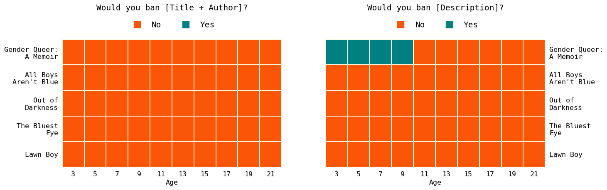
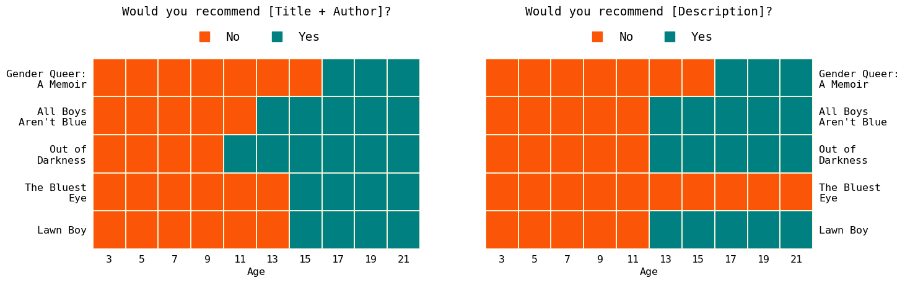

# Banned Books Analysis
Analysis of banned books corresponding with the article: [The Forbidden Pages: A Data Analysis of Book Bans in the US](https://blog.yenniejun.com/p/the-forbidden-pages-a-data-analysis). This repository has the Jupyter notebook and related data from the article.

### Overview of the article
In this article, I analyze recently banned books and authors in the US:
- I use a dataset of books banned in 2021-2022 and combine them with metadata from Google Books to examine the main topics of those books. I find that not just books about LGBTQ+ and sexuality are banned, but also books about Black history women in science. Many of the banned books were written recently (after the year 2000) and targeted towards younger audiences.

- I examine the types of authors who have written the top banned books. A majority of these authors identify as women, non-binary, and/or people of color.

- I take the most commonly banned books and ask GPT-3, ChatGPT, and Bing Chat if they would recommend those books to classrooms of different age groups.

### Data
The book bans dataset was compiled by [PEN America](https://pen.org/about-us/), a nonprofit organization that works to defend and celebrate free expression in the United States and worldwide through the advancement of literature and human rights. 

### Usage

1. Set up the Google Books API following [these instructions](https://developers.google.com/books/docs/v1/using). Once you finish registering, you will have a Google Books API key. Set that as an environment variable (refer [here](https://devconnected.com/set-environment-variable-bash-how-to/) if unsure how) as `GOOGLE_API_KEY`. This API is free to use.

2. Sign up for an OpenAI API and set that as an environment varaible as `"`OPENAI_API_KEY`. This API is pay-as-you-go.